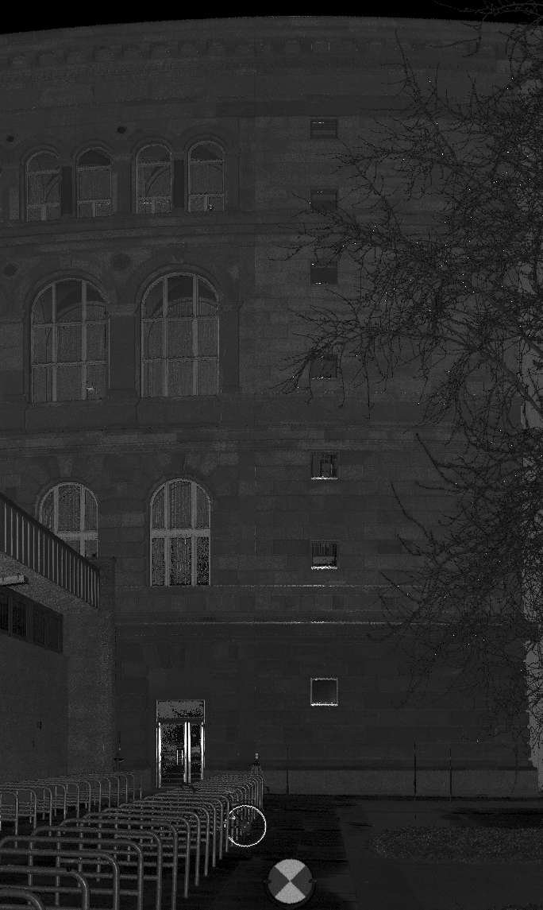
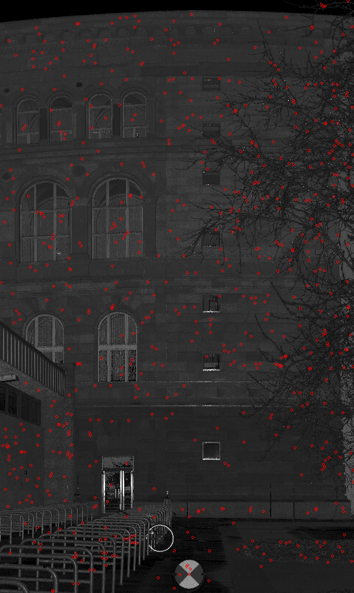
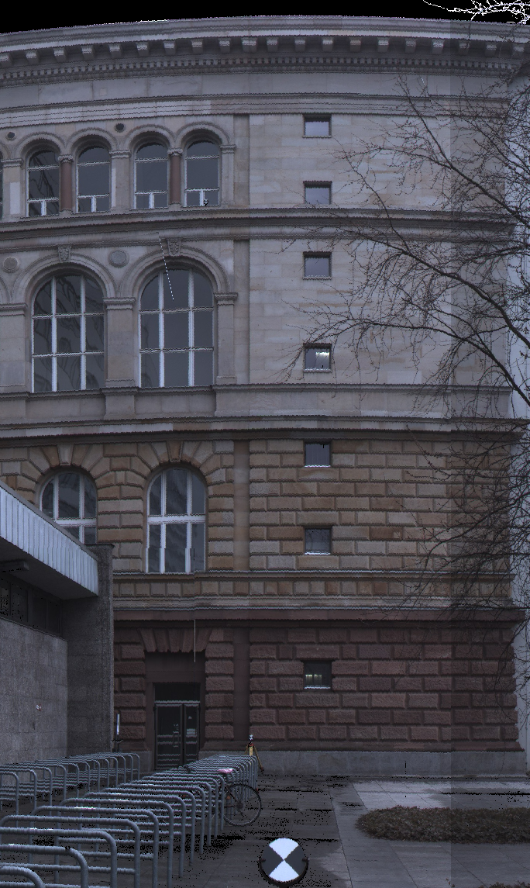
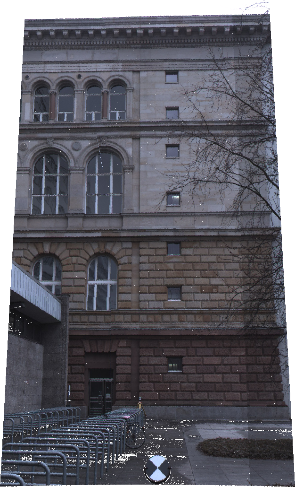
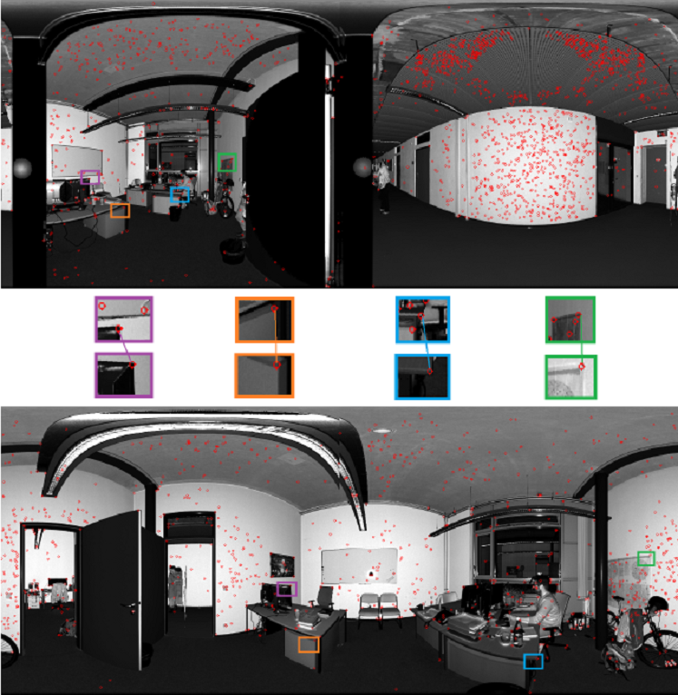
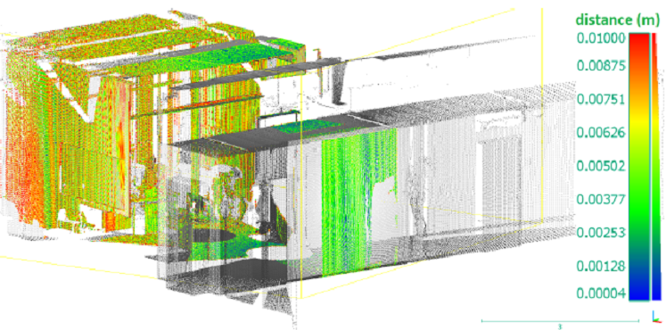

<html>
<body>
	<h2>Application of the Forstner keypoint detector</h2>
	
Laser scanning is a widely used survey technique which can be used for deformation analysis or 3D model creation. However, if scene is scanned from several points of view, the problem of point cloud correspondence arises. Registration of point clouds is an automatic procedure of data alignment, it finds matches between those parts of point clouds which are representations of the same objects. There
	are several known methods of registration such as ICP and 4PCS. Current project suggests a new one: an algorithm of registration based on radiometric features.

	
Basic idea of current method is generation of an image from every point cloud, calculation of specific members by keypoint detector and definition of correspondences based on keypoint descriptors. The image created from a pointcloud which is a result of exterior scanning of Technical University of Berlin and the result of Forstner keypoint detector application are the following: 
	
	    
	Further development of keypoint detection can be done in the direction of utilization of calibration matrix for the goal of creation of an undistorted image, so that keypoints could be defined more precisely. The following pair of images is the distorted full-color image of TU Berlin exterior wall and the result of usage of calibration matrix: 
	
	    
	Then detection of keypoints is performed on two scans of the same object. The following image shows keypoints of images and found matches:

	    
	
After the definition of matching points the corresponding keypoints were found in the 3D point clouds. Thus, parameters of transformation between two point clouds were calculated. Application of these parameters as initial registration for ICP algorithm gives the following accurate result:

	    
	
Algorithm itself, it's application and results are presented in a scientific article which was written by me and can be downloaded as a pdf-file: 
 
	
<a href="https://gitlab.tubit.tu-berlin.de/kuramin/forstner_keypoints_detector/blob/master/Keypont_detection.pdf">Algorithm of intensity based registration for terrestrial laser scans.pdf</a> 

	
Execution of the project is started by running the .bat-file which specifies required input paths.  
	Execution of this project requires presence of the OpenCV library.

</body>
</html>